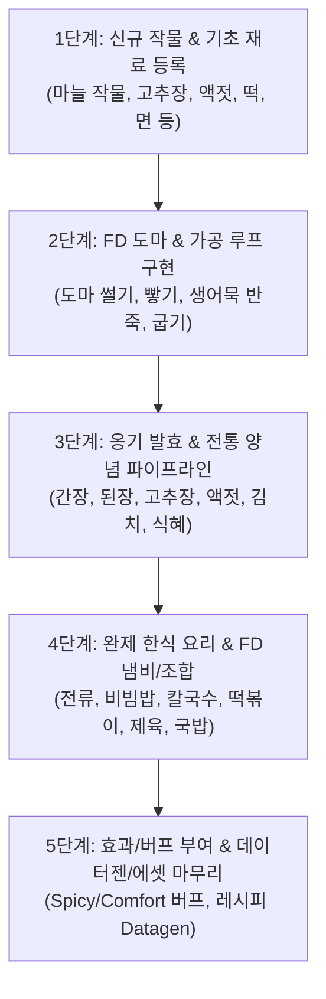

# 🗺️ KoreanDelight 개발 로드맵 (Farmer's Delight 호환)

본 문서는 `docs/recipes.md`에 명시된 한식 요리 및 가공 체계를 바탕으로, Farmer's Delight(FD) 1.21.1 환경에 맞춰 수립된 **KoreanDelight 공식 개발 로드맵**입니다.

---

## 🧭 개발 단계 개요

---

## 📌 1단계: 신규 작물 및 신규 아이템 등록 (Registry & Items)
> **목표**: 레시피에 필요한 모든 기초 재료와 작물을 코드베이스에 선언 및 등록

### 1. 작물 추가
* **마늘 (Garlic)**: 
  * 블록: `GarlicCropBlock`
  * 아이템: `garlic` (식재료 겸 파종용 쪽마늘)

### 2. 양념 및 발효 재료 추가
* `gochujang` (고추장)
* `fish_sauce` (액젓)

### 3. 중간 가공품 추가
* `minced_garlic` (다진 마늘)
* `tteok` (떡)
* `minced_fish` (다진 생선살)
* `raw_fish_cake` (생 어묵 반죽)
* `fish_cake` (구운 어묵)

### 4. 완제 및 반죽 음식 아이템 추가
* **부침개류**: `raw_kimchi_jeon` (생 김치전), `kimchi_jeon` (김치전), `raw_pajeon` (생 해물파전), `pajeon` (해물파전)
* **비빔밥**: `bibimbap` (비빔밥)
* **FD 냄비 요리류**:
  * `chicken_kalguksu` (닭칼국수)
  * `tteokbokki` (떡볶이)
  * `jeyuk_bokkeum` (제육볶음)
  * `pork_gukbap` (돼지국밥)
  * `doenjang_jjigae` (된장찌개)
* **음료**: `sikhye` (식혜 유리병)

---

## 📌 2단계: FD 도마(Cutting Board) 및 굽기/조합 가공
> **목표**: 식재료 손질 및 중간 가공 레시피 완성

### 1. 도마 (Cutting Board) 레시피 JSON
* **다진 마늘**: `마늘 (Garlic)` + 칼 ➡️ `다진 마늘 (Minced Garlic)`
* **칼국수 면**: FD의 `생파스타 면 (Raw Pasta)`을 그대로 사용
* **떡 (Tteok)**: 2단계 도마 레시피 없음; 이후 `쌀` ➡️ `밥` ➡️ `떡` 흐름으로 구현
* **다진 생선살**: FD `생 대구 / 연어 조각` + 칼 ➡️ `다진 생선살`
* **고춧가루**: `고추` + 칼 ➡️ `고춧가루 (Red Pepper Powder)`

### 2. 제작대 및 굽기 가공
* **생 어묵 반죽 (제작대)**: `다진 생선살` + `밀가루 반죽` + `다진 마늘`
* **어묵 굽기 (화덕 / 프라이팬 / 스모커 / 모닥불)**: `생 어묵 반죽` ➡️ `어묵 (Fish Cake)`

---

## 📌 3단계: 옹기 발효(Onggi) & 전통 양념 파이프라인
> **목표**: 한식의 기반이 되는 발효 양념 루프 완성

### 1. 옹기 발효 레시피 (`FermentationRecipe`) 정비
* **간장 & 된장**: `물 1000mB` + `발효된 메주 블록` ➡️ `간장 유체 1000mB` + `된장 4개`
* **액젓 (Fish Sauce)**: `물 1000mB` + `다진 생선살 4개` ➡️ `액젓 병`
* **김치 / 묵은지**: `배추` + `고춧가루` + `다진 마늘` + `액젓` ➡️ `김치` (추가 숙성 시 `묵은지`)
* **식혜**: `물 1000mB` + `밥` + `설탕` + `밀` ➡️ `식혜`

### 2. 고추장 조합/발효 레시피
* `고춧가루` + `된장/메주` + `쌀/설탕` ➡️ `고추장`

---

## 📌 4단계: 완제 한식 요리 & 조리대/냄비(Cooking Pot) 구현
> **목표**: 플레이어가 섭취할 수 있는 대표 한식 요리 완성

### 1. 부침개류 (2단계 조리)
* **김치전**: `밀가루 반죽` + `달걀` + `김치` + `간장` ➡️ `생 김치전` ➡️ 굽기 ➡️ **김치전**
* **해물파전**: `밀가루 반죽` + `달걀` + `대파` + `다진 생선살` + `간장` ➡️ `생 해물파전` ➡️ 굽기 ➡️ **해물파전**

### 2. 비빔밥 (Shapeless Crafting)
* `밥이 든 그릇 (Cooked Rice Bowl)` + `달걀프라이 (Fried Egg)` + `채소류 2~3종` + `고추장` + `간장/참기름` ➡️ **비빔밥** (섭취 시 빈 그릇 반환)

### 3. FD 요리 냄비 (Cooking Pot) 레시피 (6슬롯 + 용기)
* **닭칼국수**: `FD 생파스타 면` + `생닭고기` + `대파` + `다진 마늘` + `고추/간장` + `물병` + [그릇] ➡️ **닭칼국수**
* **떡볶이**: `떡` + `어묵` + `대파` + `양배추` + `고추장` + `간장/설탕` + [그릇] ➡️ **떡볶이**
* **제육볶음**: `돼지고기` + `양파` + `대파` + `다진 마늘` + `고추장` + `간장/설탕` + [그릇] ➡️ **제육볶음**
* **된장찌개**: `된장` + `돼지고기/소고기` + `두부` + `대파` + `다진 마늘` + `물병` + [그릇] ➡️ **된장찌개**
* **식혜 (냄비 조리)**: `밥` + `물병` + `설탕` + `밀` + [유리병] ➡️ **식혜 (유리병)**

---

## 📌 5단계: 효과(Buff) 연계, 데이터젠 및 최종 폴리싱
> **목표**: 밸런싱, 시각/청각적 완성도 및 다국어 지원

### 1. 효과 (Status Effects) 연계
* **매운맛 (`SpicyEffect`)**: 떡볶이, 제육볶음, 김치 등 섭취 시 신속 및 한기 저항 부여
* **든든함 / 포만감 (`Comfort` / `Nourishment`)**: 국밥, 닭칼국수, 비빔밥 등 메인 한식에 FD 고유 버프 부여
* **식혜 효과**: 소화 촉진 (부정적 효과 1개 정화 또는 재생)

### 2. 데이터젠 & 다국어
* [`ModRecipeProvider`](file:///E:/Develop/Java/KoreanDelight1.20.1/common/src/main/java/com/potan/koreandelight/data/ModRecipeProvider.java) 조합법 Datagen 자동화
* 한국어([`ko_kr.json`](file:///E:/Develop/Java/KoreanDelight1.20.1/common/src/main/resources/assets/koreandelight/lang/ko_kr.json)) 및 영어([`en_us.json`](file:///E:/Develop/Java/KoreanDelight1.20.1/common/src/main/resources/assets/koreandelight/lang/en_us.json)) 번역 완성
